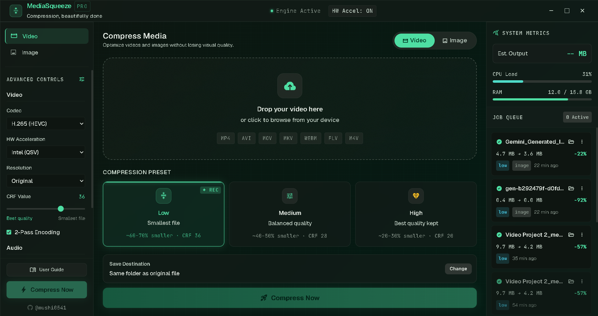
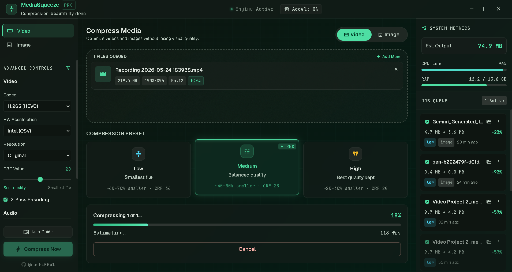
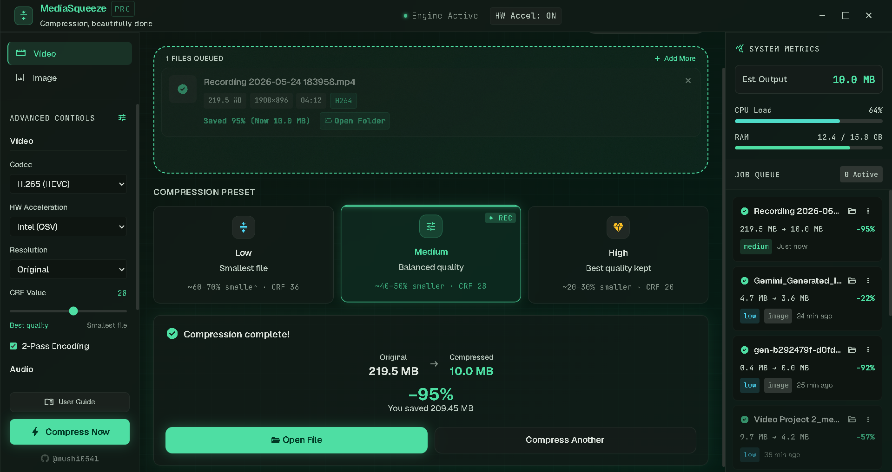
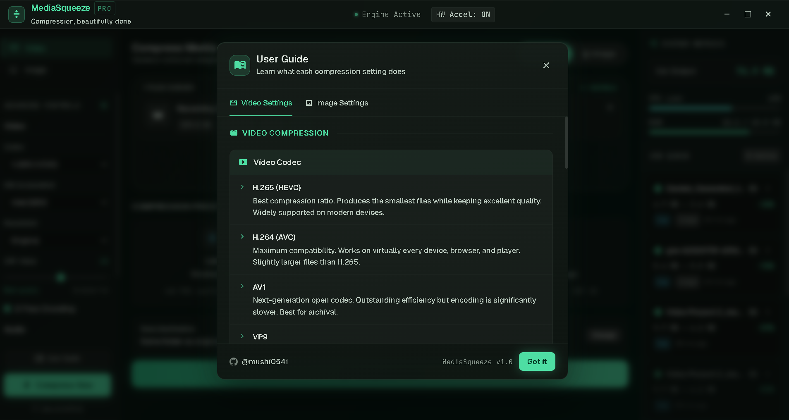

<h1 align="center">MediaSqueeze 🗜️</h1>

<p align="center">
  <strong>A blazing-fast, commercial-grade desktop media compression application.</strong>
</p>

<p align="center">
  
  
  
  
  
</p>

<p align="center">
  
</p>

---

## ✨ Why MediaSqueeze?

* **100% Offline & Private:** Your files never leave your PC.
* **Blistering Fast:** Leverages your native GPU (Nvidia/AMD/Intel) to compress media up to 10x faster than CPU-only alternatives.
* **Professional Grade:** Uses battle-tested FFmpeg under the hood but wraps it in a gorgeous, user-friendly UI.

---

## 🚀 Key Features

- **Hardware Acceleration:** Native GPU encoding support for **Nvidia (NVENC)**, **AMD (AMF)**, and **Intel (QSV)**.
- **Batch Queue Processing:** Drag-and-drop hundreds of videos or images and let the app process them automatically in sequence.
- **Multi-format Support:** 
  - *Video:* MP4, AVI, MOV, MKV, WEBM, FLV, M4V
  - *Image:* JPG, PNG, WEBP, AVIF, TIFF, BMP, GIF
- **Live System Monitoring:** Track your CPU and Memory usage in real-time directly within the sidebar.
- **Smart Estimation:** Real-time ETA, file size predictions, and FPS tracking for active compressions.
- **Persistent Memory:** Automatically saves your presets, target directories, and hardware acceleration choices across app restarts.
- **Safe Cancellation:** Instantly kill processes mid-compression and automatically clean up corrupted/partial files safely.
- **Native OS Integration:** One-click "Open Folder" shortcut to instantly locate your compressed files natively in Windows Explorer.

---

## 📥 Download & Install

You do **not** need to install FFmpeg or any complicated dependencies! 

MediaSqueeze is distributed as a **single, standalone installer** that comes pre-bundled with everything you need to run it perfectly out of the box.

👉 **[Download the Latest Installer Here](https://your-website-link-here.com)**

### Quick Start:
1. Double-click the `.exe` or `.msi` file.
2. Follow the quick installation prompts.
3. Open MediaSqueeze and start compressing immediately!

*(An `INSTALL_INSTRUCTIONS.txt` file is also available on the website for quick reference).*

---

## 📸 Interface Showcase

<p align="center">
  
  &nbsp;
  
</p>

<p align="center">
  
</p>

---

## 🛠️ Local Development

### Prerequisites
- [Node.js](https://nodejs.org/) (v18+)
- [Rust & Cargo](https://rustup.rs/)
- FFmpeg (Ensure FFmpeg is installed and accessible, or bundled as a Tauri sidecar in `src-tauri/binaries`)

### Setup Instructions

1. **Clone the repository:**
   ```bash
   git clone https://github.com/mushi0541/MediaSqueeze.git
   cd MediaSqueeze
   ```

2. **Install frontend dependencies:**
   ```bash
   npm install
   ```

3. **Run the development server:**
   ```bash
   npm run tauri dev
   ```

4. **Build for production** *(Generates Windows `.exe` / `.msi` installers)*:
   ```bash
   npm run tauri build
   ```

---

## 💬 Feedback & Issues

We are always looking to improve MediaSqueeze! 

If you encounter any bugs, have questions, or want to request a new feature, please **open an issue** on GitHub:
👉 [Create an Issue Request](https://github.com/mushi0541/MediaSqueeze/issues)

---

## 📜 License

This project is licensed under the MIT License - see the LICENSE file for details.

Developed with ❤️ by **Mushahid** ([@mushi0541](https://github.com/mushi0541))
